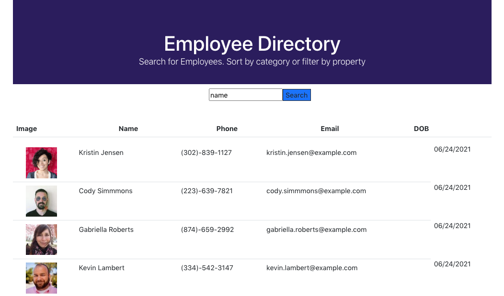

# React_EmployeeDirectory

## Overview

Unit 19 React Homework: Employee Directory

For this assignment, I've created an employee directory with React by breaking the application's UI into separate components to manage component state, and respond to user events. 

Using the [Random User API](https://randomuser.me/), when a user loads the page, a table of employees is also rendered on the page. The user is able to sort the table by multiple categories, and filter the users by multiple properties. 

This application was bootstrapped with `Create-React-App` and is deployed on GitHub Pages:

[React Employee Directory GH-Pages](/)

[React Employee Directory Repo](/)

## Table of Contents
* [User Story](#user-story)
* [Business Context](#business-context)
* [Mock Up](#mock-up)
* [Installation](#installation)
* [Usage](#usage)
* [Deployment](#deployment)
* [Acceptance #Citeria](#)
* [Resources](#resources)
* [Submitted For Review](#submitted-for-review)
* [Questions](#questions)
* [License](#license)


## User Story
```
As a user, I want to be able to view my entire employee directory at once so that I have quick access to their information.
```
## Business Context

An employee or manager would benefit greatly from being able to view non-sensitive data about other employees. It would be particularly helpful to be able to filter employees by name.

## Mock Up




## Installation

`Node.Js` is required to install this application.

`Ajax` is the preferred method for making API calls. 

`JSON` is the default format for data transmission.

Refer to [Random User Generator API](https://randomuser.me/documentation#intro) documentation for more information on generating random user data.

Fork or Clone Repository, then run the following commands:

`npx i create-react-app.js` 

`npm i boostrap` css-framework.

`npm i axios` HTTP client for the browser and node.js.


 ## Usage

`npm start` 
Runs the app in the development mode.
Open `http://localhost:3000`to view it in the browser.

`npm test`
Launches the test runner in the interactive watch mode.
See the section about running tests for more information.

`npm run build` 
Builds the app for production to the build folder.

`npm run eject`
 This command will remove the single build dependency from your project.  

## Deployment

`gh-pages` branch used to host deployed application:[Employee Directory](/)

`main` codebase pushed to Github: [react-employee-directory-main](https://github.com/rdevans87/React_EmployeeDirectory))


## Acceptance Criteria

Given a table of random users generated from the [Random User API](https://randomuser.me/), when the user loads the page, a table of employees should render. 

The user is be able to:

  * Sort the table by at least one category

  * Filter the users by at least one property.
  
  * Codebase pushed to GitHub **NOT** deployed code.
  
  * `gh-pages` branch used to host the deployed application's code. 

## Resources 

[Create React App documentation](https://facebook.github.io/create-react-app/docs/getting-started).

[React documentation](https://reactjs.org/).

[Code Splitting](https://facebook.github.io/create-react-app/docs/code-splitting)

[Analyzing the Bundle Size](https://facebook.github.io/create-react-app/docs/analyzing-the-bundle-size)

[ Making a Progressive Web App](https://facebook.github.io/create-react-app/docs/making-a-progressive-web-app)

[Advanced Configuration](https://facebook.github.io/create-react-app/docs/advanced-configuration)

[Deployment](https://facebook.github.io/create-react-app/docs/deployment)

### `npm run build` fails to minify

This section has moved [here](https://facebook.github.io/create-react-app/docs/troubleshooting#npm-run-build-fails-to-minify)

## Submitted for Review

You are required to submit the following:

* the URL to the deployed application

* the URL to the Github repository


## Questions

[GitHub Profile](https://github.com/rdevans87)


## License

[MIT LICENSE](LICENSE)